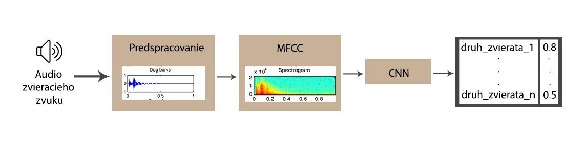

# Klasifikácia zvieracích zvukov

__Autori:__ Dominik Jurečko & Simona Glombíková  

## Motivácia

Zvuky sú prirodzenou súčasťou života každého z nás. Náš mozog dokáže vnímať zvuky nepretržite a následne ich spracovať. Spracovaním vznikne potrebná informácia. Zachytené poznatky mám zvyšujú kvalitu života a dotváraju ďalší senzor možnosti poznania. Práve pomocou sluchu môžeme detekovať, že nemôžeme prejsť cez cestu, vypočuť si kamaráta alebo spríjemniť si cestovanie obľúbenou hudbou.

Detekcia zvierat na základe počutia je začiatočným krokom pri učení detí rozpoznávať zvieratá, avšak len málo z nás sa nad zvieracími zvukmi zamyslí aj inak. A to pohľadu komunikácie. Veľryby sa vzhľadom na nedostatok viditeľnosti v moriach a nedostatočnému zraku dorozumievajú zvukmi, echolokáciou. Vďaka nej môžu detekovať nebezpečenstvo alebo iného jedinca v okolí. Keďže v našej oblasti veľrybu asi ťažko uvidíme, predstavme si domácich maznáčikov. Zvuk ktoréhokoľvek z nich môže pre nás predstavovať pomoc z hľadiska bezpečnosti, či predpovedania prírodných katastrof.

Identifikácia druhu zvierat je prirodzený spôsob kontroly životného prostredia a posudzovania biodiverzity. Preto je dôležitosť klasifikovanie druhu zvieraťa po vypočutí zvukovej vzorky veľmi dôležitá.

## Hypotéza

S akou pravdepodobnosťou sa zvierací zvuk identifikuje k triedam hľadaných zvierat?

## Podobné práce

Skúmanie zvuku má v dnešnom svete vzostupný charakter. V podobných prácach sme narazili na generalizáciu tohto problému bez ohľadu na domény. Zvukový súbor (napríklad vo formáte .wav) pomocou predspracovaní a extrahovania vstúpi do výpočtu ako spektogram alebo MFCC spektogram. 
> Hlavný rozdiel spočíva v tom, že spektrogram používa lineárnu frekvenčnú stupnicu (takže každý kmit je od seba vzdialený rovnakým počtom Hertzov), zatiaľ čo MFCC spektogram používa logaritmickú frekvenčnú stupnicu, ktorá je podobnejšia ľudskému zvukovému vnímaniu. 

Prístup klasifikácie z predspracovaných dát sa delil na 2 množiny. 
 1. Skrytý Markov Model (ďalej HMM) - po predspracovaných dátach je potrebná ešte vektorová kvantizácia. Tento model je známy svojou použiteľnosťou na poli rozpoznávania časových vzorov, teda je použiteľný aj na náš problém. Základný vzor je Markov model, od ktorého je HMM odvodené práve kvôli skrytiu stavu. Avšak výstup viditeľný je. [3][4]
 2. Konvolučné neurónové siete (ďalej CNN) - siahajú až do 80. rokov, ale len nedávno boli prijaté ako metóda výberu pre rôzne úlohy klasifikácie objektov. V prácach sa líšil počet použitých vrstiev konvolučných sietí. Boli použité 2 [2] - 3 [1] vrstvy s maximálnym združovaním a dropdown-om. Aktivácia pri vrstvách bola vykonávaná pomocou funkcie ReLU.

## Návrh riešenia na vysokej úrovni

Vstup do klasifikácie zvieracích zvukov je surový súbor obsahujúci krátke audio jedného zvieracieho zvuku (napr. štekajúci pes). 

_Predspracovanie_ - Zvukové vlny sa digitalizujú ich vzorkovaním v diskrétnych intervaloch známych ako vzorkovacia frekvencia. Každá vzorka je amplitúda vlny v konkrétnom časovom intervale, kde bitová hĺbka určuje, ako podrobne bude vzorka známa aj ako dynamický rozsah signálu. Následne takto vytvorenú dátovú množinu znormalizujeme.

_MFCC_ - Ďalším krokom algoritmu je z normalizovaných dát vyextrahovať vlastnosti, ktoré budeme pri trénovaní dát používať. Rozhodli sme sa použiť MFCC spektogram kvôli spomínanej podobnosti s ľudským vnimaním zvuku.

_CNN_ - Na začiatku sa budeme držať prístupu z podobných prác [2] a [1], ktorý sme predstavili vyššie.Následne budeme iterovať až kým nedosiahneme, čo najlepšie výsledky. 

Tabuľka zobrazujúca výstup na obrázku znázorňuje s akou pravdepodobnosťou zvuk zvieraťa na vstupe patrí do druhu zvieraťa/triedy zvieraťa.

## Citácie

[1] J. Salamon and J. P. Bello, "Deep Convolutional Neural Networks and Data Augmentation for Environmental Sound Classification," in IEEE Signal Processing Letters, vol. 24, no. 3, pp. 279-283, March 2017.

[2] K. J. Piczak, "Environmental sound classification with convolutional neural networks," 2015 IEEE 25th International Workshop on Machine Learning for Signal Processing (MLSP), Boston, MA, 2015, pp. 1-6.

[3] Vacher, Michel & Serignat, Jean-François & Chaillol, Stéphane. (2007). Sound Classification in a Smart Room Environment: an Approach using GMM and HMM Methods

[4] Balemarthy, Siddhardha & Sajjanhar, Atul & Zheng, Xi. (2018). Our Practice Of Using Machine Learning To Recognize Species By Voice. 