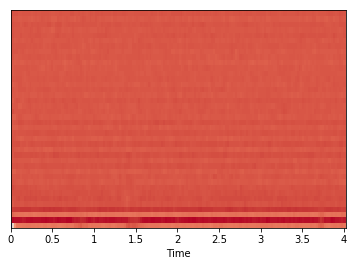
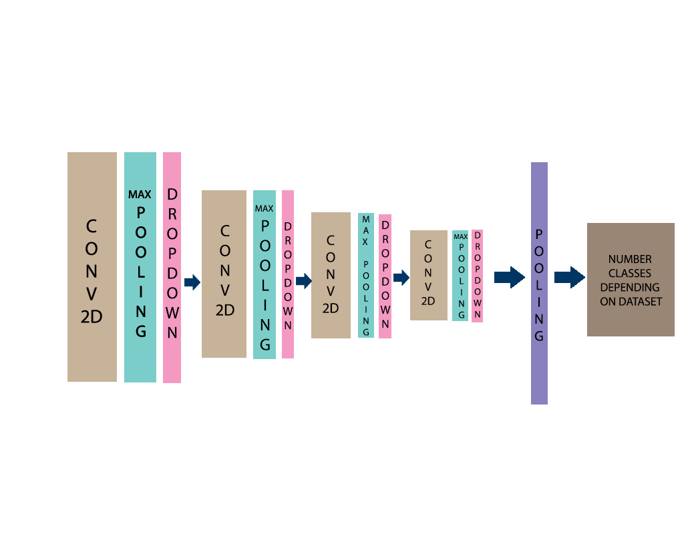
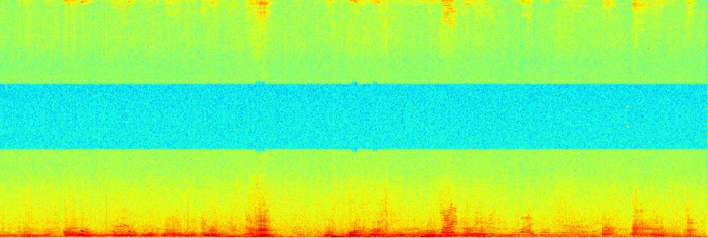
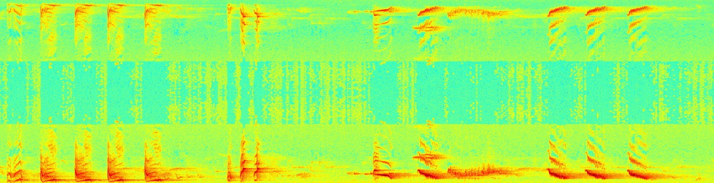

# Klasifikácia zvieracích zvukov

__Autori:__ Dominik Jurečko & Simona Glombíková  

## Motivácia

Zvuky sú prirodzenou súčasťou života každého z nás. Náš mozog dokáže vnímať zvuky nepretržite a následne ich spracovať. Spracovaním vznikne potrebná informácia. Zachytené poznatky mám zvyšujú kvalitu života a dotváraju ďalší senzor možnosti poznania. Práve pomocou sluchu môžeme detekovať, že nemôžeme prejsť cez cestu, vypočuť si kamaráta alebo spríjemniť si cestovanie obľúbenou hudbou.

Detekcia zvierat na základe počutia je začiatočným krokom pri učení detí rozpoznávať zvieratá, avšak len málo z nás sa nad zvieracími zvukmi zamyslí aj inak. A to pohľadu komunikácie. Veľryby sa vzhľadom na nedostatok viditeľnosti v moriach a nedostatočnému zraku dorozumievajú zvukmi, echolokáciou. Vďaka nej môžu detekovať nebezpečenstvo alebo iného jedinca v okolí. Keďže v našej oblasti veľrybu asi ťažko uvidíme, predstavme si domácich maznáčikov. Zvuk ktoréhokoľvek z nich môže pre nás predstavovať pomoc z hľadiska bezpečnosti, či predpovedania prírodných katastrof.

Identifikácia druhu zvierat je prirodzený spôsob kontroly životného prostredia a posudzovania biodiverzity. Preto je dôležitosť klasifikovanie druhu zvieraťa po vypočutí zvukovej vzorky veľmi dôležitá.

## Hypotéza

S akou pravdepodobnosťou sa zvierací zvuk identifikuje k triedam hľadaných zvierat?

## Podobné práce

Skúmanie zvuku má v dnešnom svete vzostupný charakter. V podobných prácach sme narazili na generalizáciu tohto problému bez ohľadu na domény. Zvukový súbor (napríklad vo formáte .wav) pomocou predspracovaní a extrahovania vstúpi do výpočtu ako spektogram alebo MFCC spektogram. 
> Hlavný rozdiel spočíva v tom, že spektrogram používa lineárnu frekvenčnú stupnicu. Zatiaľ čo MFCC spektogram používa logaritmickú frekvenčnú stupnicu, ktorá je podobnejšia ľudskému zvukovému vnímaniu. 

Prístup klasifikácie z predspracovaných dát sa delil na 2 množiny. 
 1. Skrytý Markov Model (ďalej HMM) - po predspracovaných dátach je potrebná ešte vektorová kvantizácia. Tento model je známy svojou použiteľnosťou na poli rozpoznávania časových vzorov, teda je použiteľný aj na náš problém. Základný vzor je Markov model, od ktorého je HMM odvodené práve kvôli skrytiu stavu. Avšak výstup viditeľný je. [3][4]
 2. Konvolučné neurónové siete (ďalej CNN) - siahajú až do 80. rokov, ale len nedávno boli prijaté ako metóda výberu pre rôzne úlohy klasifikácie objektov. V prácach sa líšil počet použitých vrstiev konvolučných sietí. Boli použité 2 [2] - 3 [1] vrstvy s maximálnym združovaním a dropdown-om. Aktivácia pri vrstvách bola vykonávaná pomocou funkcie ReLU.

## Dataset

Použitiu neurónových sietí na klasifikačné úlohy predchádza proces ich trénovania. Počas tohto procesu neurónová sieť, extrahovaním hlbšieho významu z poskytnutých dát, získavá požadovanú schopnosť zaradiť objekt do vybraných tried. Trénovanie neurónovej siete priamo závisí na samotnom návrhu a implementácii neurónovej siete, ako aj na kvalite a kvantite dát poskytnutých na jej učenie.

Dáta potrebné na trénovanie a následne overenie funkčnosti neurónovej siete je možné získať z niekoľkých zdrojov, z ktorých dostupné sú:
1. Extrakcia zvukov zvierat z video súborov (napr. videá z youtube)
2. Použitie amatérskych datasetov a zvukových súborov (zvukové banky)
3. Použitie verejných zvukových archívov zozbieraných vedeckými inštitúciami

Pri zohľadnení kvality, vierohodnosti (nie je možné manuálne overiť každý zvukový súbor) a robustnosti dostupných zdrojov, je posledný spomínaný zdroj (verejné zvukové archívy) najvhodnejším z nich.

Voľne dostupné zvukové archívy, ktoré poskytujú požadované dáta:
1. [Zvukový archív zvierat Prírodovedného múzea v Berlíne](https://www.gbif.org/dataset/b7ec1bf8-819b-11e2-bad2-00145eb45e9a)
2. [Zvuková knižnica Macaulay](https://www.macaulaylibrary.org)

Tieto datasety spoločne poskytujú viac ako stotisíc zvukových nahrávok rôznych druhov zvierat. Nájdeme v nich kratšie aj dlhšie zvukové nahrávky (od dvoch sekúnd, až po niekoľko minút). Okrem zvukových nahrávok a dát o nich, datasety poskytujú aj základné informácie (identifikátor, meno, ...) o zvierati prislúchajúcom k zvukovej stope. Tieto dáta je následne možné jednoducho rožšíriť pomocou ľahko dostupných informácií o vybranom zvierati, čo môže pomôcť k vyššej presnosti klasifikácie (napr. odlíšenie zvukov párnokopytníkov a vtákov podľa príslušnosti k zvieraciemu radu).

## Vlastnosti datasetov
###1. dataset (maculaylibrary)
Táto databáza zvukov je čo do veľkosti najväčšia. Avšak ponúka iba jednoduché webové vyhľadávanie bez štruktúrovanej filtrácie dát (nemá ani žiaden zoznam dostupných súborov a ich url adries, ani žiaden archív na stiahnutie). Tieto dáta je v našom prípade nemožné vyhľadávať a overiť ručne (obmedzenie času) a preto sme sa zamerali na druhý dostupný dataset.

###2. dataset (archív múzea v Berlíne)
Tento dataset má formu csv súboru, kde poskytujete základné informácie o zvierati (typ súboru, meno zvieraťa v latinčine), odkaz na stiahnutie príslušnej zvukovej stopy a odkaz na bližšie informácie o zvukovej stope (primárne geografické dáta o lokalite v ktorej bola zvuková stopa zachytená).

Príklad jedného záznamu v datasete:
```
779844256	Sound	audio/mpeg	http://www.tierstimmenarchiv.de/recordings/Accipiter_gentilis_PF00001_short.mp3	http://www.tierstimmenarchiv.de/webinterface/contents/showdetails.php?edit=-1&unique_id=FRA:Accipiter_gentilis_PF00001&autologin=true	http://creativecommons.org/licenses/by-nc-sa/4.0/	
```

#### Obohatenie datasetu
Dataset múzea v Berlíne obsahuje iba meno zvieraťa a samotnú zvukovú stopu. Preto sme ho chceli obohatiť o ďalšie informácie, ktoré sú o zvierati voľne dostupné na internete (najmä druh zvieraťa napr. vták, hmyz, ...).

Na túto úlohu sme využili automatické vyhľadávanie zvierat na službe google a následné parsovanie výsledkov (najmä informačnej časti načítavanej z rôznych wiki stránok). Tento prístup bol zvolený z dôvodu absencie všeobecnej webovej encyklopédie o zvieratách. Následne sme ešte pre niektoré zvieratá priradili informácie o druhu manuálne.

#### Analýza dát
Agregáciou získaných a stiahnutých dát o zvieratách a zvukových stopách sme získali tieto informácie o datasete:

```
# Zvieratá
Počet všetkých zvierat:                             1934
Počet zvierat automaticky zaradených k druhu:       455
Počet automaticky priradených druhov:               11
Njačastejsie sa vyskytujúce druhy:                  1. Vták, 2. Živočích, 3. Hmyz

# Zvukové stopy
Počet url adries v datasete:                        16409
Počet platných/funkčných url adries:                16258
Najkratšia zvuková stopa:                           7s
Najdlhšia zvuková stopa:                            88s
```
## Predspracovanie zvukových stôp
1. **Stiahnutie zvukovej stopy**
2. **Odstránenie miest s nízkou hlasitosťou("ticho") zo zvukovej stopy**
3. **Transformácia vzorkovacej frekvencie zvukovej stopy**  
Väčšina pôvodnych zvukových stôp má vzorkovaciu frekvenciu 44100 Hz, ale nájdu sa aj stopy s menšou frekvenciou. Preto je potrebné ju zjednotiť. Preto vzorkovaciu frekvenciu všetkých stôp konvertujeme na 22050 Hz (ktorá je vhodná pre budúce spracovanie našim modelom). 
3. **Normalizovanie bitovej hĺbky**  
Týmto procesom zabránime rôznym rozsahom bitovej hĺbky zvukových stôp. Výsledkom tohto kroku je transformovaná bitová hĺbka v rozsahu od -1.0 do 1.0.
4. **Spojenie zvukových kanálov**  
Spájame zvukové kanály stereo zvukových stôp. Výsledkom je zvuková stopa s mono kanálom. 
5. **Rozloženie zvukovej stopy na menšie časti rovnakej dĺžky**

#### Grafická reprezentácia transformácie zvukovej stopy do formy vhodnej na trénovanie 
**Pred spracovaním:**  


**Po spracovaní:**  


## Reprezentácia zvukových stôp pomocou spektogramov
MFCC sumarizuje vzorkovaciu frekvenciu pomocou veľkosti okna, a tak je možné analyzovať obidve frekvenčnú aj časovú charakteristiku zvukov. Pomocou tejto reprezentácie môžeme identifikovať vlastnosti potrebné pre klasifikáciu.

**Príklad MFCC spektogramu:**  


## Experimenty

### Úvodný experiment
#### Opis priebehu
Týmto 

#### Výsledky


## Návrh riešenia na vysokej úrovni

Vstup do klasifikácie zvieracích zvukov je surový súbor obsahujúci krátke audio jedného zvieracieho zvuku (napr. štekajúci pes). 

__Predspracovanie__ - Zvukové vlny sa digitalizujú vzorkovaním v diskrétnych intervaloch - vzorkovacia frekvencia. Každá vzorka je amplitúda vlny v konkrétnom časovom intervale. Bitová hĺbka určuje podrobnosť vzorky a jej dynamického rozsahu signálu. Následne takto vytvorenú dátovú množinu znormalizujeme.

__MFCC__ - Ďalším krokom algoritmu je zo normalizovaných dát vyextrahovať vlastnosti, ktoré budeme pri trénovaní dát používať. Rozhodli sme sa použiť MFCC spektogram kvôli spomínanej podobnosti s ľudským vnímaním zvuku.

__CNN__ - Na začiatku sa budeme držať prístupu zo sekcie podobných prác [2] a [1], ktorý sme predstavili vyššie. Následne sa pokúsime iteráciou dosiahnuť, čo najlepšie výsledky. 

Tabuľka zobrazujúca výstup na obrázku znázorňuje s akou pravdepodobnosťou zvuk zvieraťa na vstupe patrí do druhu zvieraťa/triedy zvieraťa. Zvuková stopa (zvuk zvieraťa) je klasifikovaná do triedy s najvyššou pravdepodonosťou správnej predikcie.


## Opis modelu

Finálny model na klasifikáciu zvukov zvierat vidíme na obrázku. Model prešiel iteráciami na základe podobných prác bol navrhnutý ako jednoduchý prototyp, ktorý sme vylepšili na finálny model.




## Proces trénovania

1. Vytvorenie dataset, zahŕňa proces konvertovania mp3 na wav, rozdelenia na 3 sekudové úseky a zmeny na MFCCS spektogram. Výstupom procesu vytvorenia
datasetu je .csv súbor s cestou k zvukovej zložke zvieraťa a ďalšie pridané parametre podľa  potreby experimentov.
2. Ako vstup do neurónovej siete je potrebné dať maticu v správnom tvare. Predspracovanie z každej položky z vytvoreného datasetu na matice o veľkosti 4 x 10 nám vytváralo vyššiu časovú zložitosť ako samotné trénovanie. Na vyriešenie problému sme zvloli prístup serializácie matíc, ktoré už boli predpočítané. V prvom behu sa teda matice serializovali a v ďalších iteráciach experimentu boli použité už predpočítané matice.
3. Rozdelenie datasetu na trénovací a testovací
4. Proces trénovania, evaluácia a predikcia 
5. Zlepšovanie výsledkov sme vykonávali pomocou konfigurácie parametrov priamo z konzoly alebo zapísaním do konfiguračného súbora

Na celý proces sme využili Google Cloud Transform, ktorý nám urýlchlil trénovania na svojích GPU.

Po poznaní neurónovej siete sme zaviedli aj Early Stopping pre šetrenie času.
`EarlyStopping(monitor='loss', patience=8)`

## Vykonané experimenty

__1. Experiment 1__
__2. Experiment 2 - Klasifikácia názvu vtákov__
 
Vstup do neurónovej siete sú vzorky zvierat iba druhu vtákov, týmto experimentom sme chceli zistiť ako naša neurónová sieť dokáže rozoznať vtáčie názvy.
Klasifikovanli sme tieto názvy vtákov: Drozd plavý, Kukučka obyčajná, Strnádka žltá, Strnádka záhradná, Trsteniarik spevavý, Chrapkáč poľný
Počet samplov 6973.

V prvých fázach sme trénovali s hodnotami:

`{
  "batch_size": 128,
  "learning_rate": 0.5,
  "dynamic_learning_rate": false,
  "num_epochs": 20,
  "verbose": 1
}`

Pri takýchto parametroch daný experiment dosahoval úspešnosť 85%. Úspešnosť sme skúšali zvýšiť pomocou ladenia parametrov, 
inkrementácia epoch nám presnosť nezmenila, preto sme sa zamerali na learning_rate. V poslednom trénovaní sme dosiahli 92% 
úspešnosť pomocou týchto parametrov.

`{
  "batch_size": 128,
  "learning_rate": 0.001,
  "dynamic_learning_rate": false,
  "num_epochs": 20,
  "verbose": 1
}`

__3. Experiment 3 - Klasifikácia druhu zvieraťa__

Po experimente číslo 2 nebola očakávaná taká vysoká presnosť, preto sme sa rozhodli skúsiť experiment na zvieratách rozličného druhu a tým porovnať koleráciu podobných a rozdielnych zvukových stôp.
Pri poČiatoňom trénovaní sme trénovali na všetkých dátach, ktoré mali určený druh. Avšak museli sme tento prístup minimalizovať, preto sme si vybrali klasifikáciu iba dvoch rôznych druhov vtákov a cicavcov. Kvôli nedostatku cicavcov v datasete sme experiment ešte uprvili na dve zvieratá. 
Zároveň tento experiment prebiehal s parametrami, ktoré nám dosahovali vysokú úroveň v experimente číslo 2. 
Vybrali sme iba dve zvieratá na klasifikáciu: leva a drozda.  

Mffc spektogram leva


Mffc spektogram drozda



Výsledok evaluácie modelu: 
`[0.03709476282511984, 0.988794]`
Experiment ukázal, že rozlišovanie dvoch druhov má vyššiu úspešnosť 98% ako rozlišovanie podobných zvukových stôp. Prvá epocha mala úspešnosť 68%.

Vylepšenie tohto experimentu by sa dalo dosiahnuť pomocou pridaní, reps. využíti techniky šumu na zvukové stopy, čím by sme dosiahli viac vzoriek.
 

## Citácie

[1] J. Salamon and J. P. Bello, "Deep Convolutional Neural Networks and Data Augmentation for Environmental Sound Classification," in IEEE Signal Processing Letters, vol. 24, no. 3, pp. 279-283, March 2017.

[2] K. J. Piczak, "Environmental sound classification with convolutional neural networks," 2015 IEEE 25th International Workshop on Machine Learning for Signal Processing (MLSP), Boston, MA, 2015, pp. 1-6.

[3] Vacher, Michel & Serignat, Jean-François & Chaillol, Stéphane. (2007). Sound Classification in a Smart Room Environment: an Approach using GMM and HMM Methods

[4] Balemarthy, Siddhardha & Sajjanhar, Atul & Zheng, Xi. (2018). Our Practice Of Using Machine Learning To Recognize Species By Voice. 
